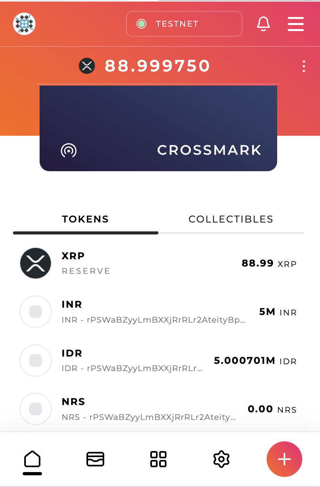

# APEX Hackathon XRP Ledger

StableX. Offers an innovative platform in XRP-ledger local stable coins to help immigrant worker and expats cut remittance and commission costs by 70% while maintaining high-speed delivery.

## How it works?

We provide a AI Chat interface to be able to talk with user what is their intent. What currency they want to transfer and from what currency and the amount.

The AI and backend shared `sessionId`. AI will ask backend for the quote, then backend will answer with up-to-date quote. Then after that once user confirm we execute the transacation. And backend send info to frontend to initiate transfer using Crossmark browser. Then results is being processed.

Summary

1. Connect wallet
2. Talk to AI what currency from and to, amount
3. AI ask for rate to backend
4. AI confirms to user
5. User confirms
7. AI lock the quote
8. Backend tell frontend to initiate sign transaction
9. User sign in the frontend using Cross mark
10. Transfer initiated
11. Now we will burn the stable in local currency
12. StableX initiate money transfer out using the local transfer
13. AI will notify the update to the user

## Some screenshots:

## The code

The code is divided into 2 parts:

- [Backend](./backend)
- [Frontend](./templates/next)
- AI

